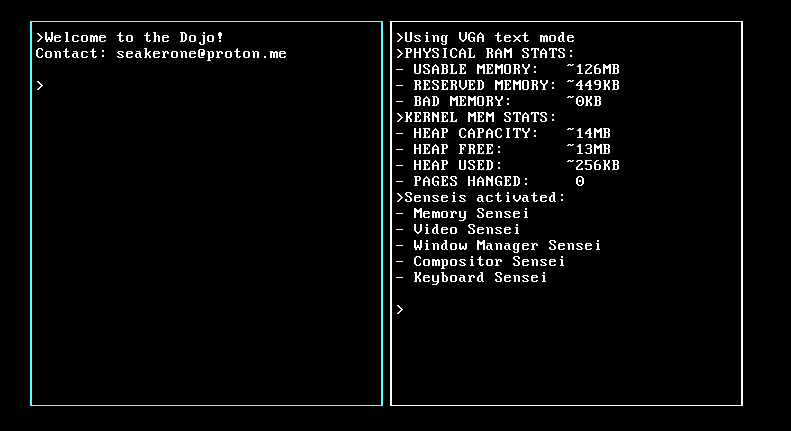

# Seaker's Dojo

**Seaker's Dojo (skdojo)** is a bare-metal computing environment 
designed for direct interaction with the machine

It is not a traditional operating system. 
Maybe it is not an operating system at all in the modern sense, 
where the responsibilities and use cases are countless.

skdojo is a **dojo for computation**; a place to create, run, and explore programs from within the system itself.

---

## Philosophy

skdojo is built around simplicity, control, and clarity.

The goal is to create a system that is:

- understandable
- hackable
- extensible
- self-contained

---

## Status

### Bootloader
    - 2-stage bootloader for x86 systems
    - Boot from BIOS
    - Loads disk sections with BIOS extensions
    - RAM detection
    - A20 line
    - GDT
    - IDT
    - Protected Mode 
    - Long mode (64-bit)
### Kernel
    - Kernel structure in C
    - VGA text output
    - Keyboard Input (IRQ-driven)
### Video System 
    - VGA text mode driver 
    - Generic cell-based rendering interface 
    - Framebuffer abstraction per window 
### Input 
    - PS/2 keyboard driver 
    - Interrupt-driven event system 
    - Keyboard event queue
### Window System 
    - Multiple windows
    - Focus management
    - Independent framebuffers

## In Progress

- Further develop Bootloader and Kernel
- Block-based system implementation
- Dojo environment (REPL / interactive programming model)

# Notes

- Written in:
    - Assembly (bootloader)
    - C (kernel)
- Boot process:
    - BIOS -> Stage 1 -> Stage 2 -> Kernel
- VGA text mode used for output
- Interrupts used for input handling
